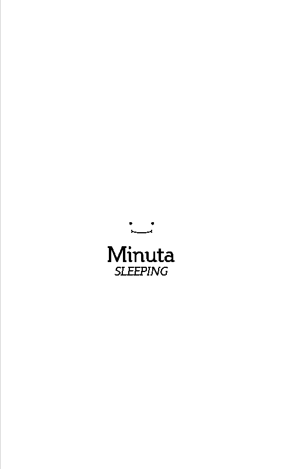
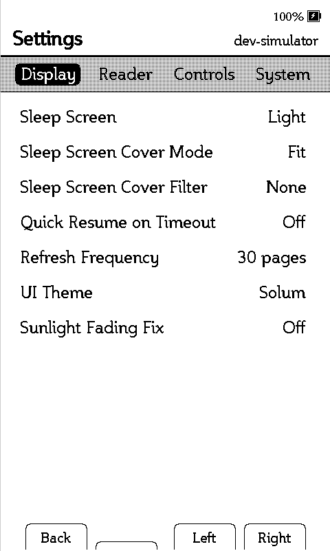
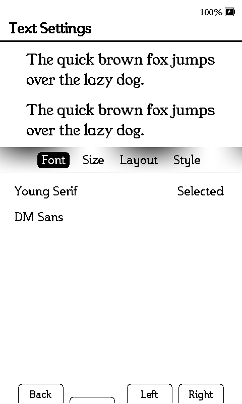
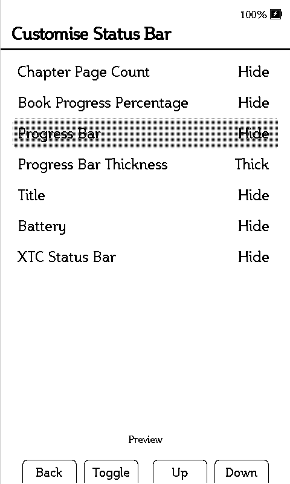
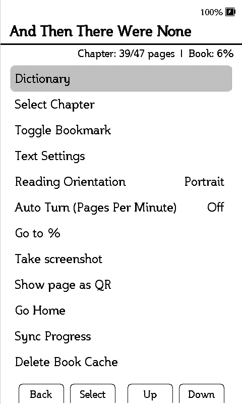
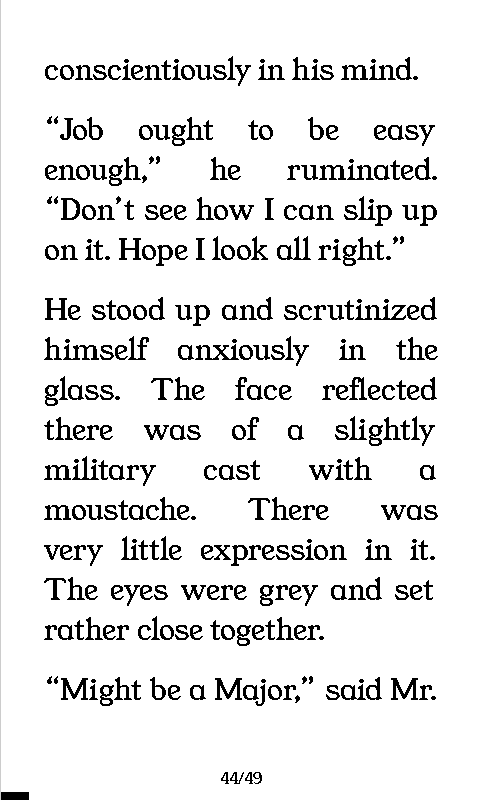

# Minuta

> A personal XTEINK X4 firmware fork made for a soft, simple, and pretty reading experience.

Minuta is a personal fork of [CrossPoint Reader](https://github.com/crosspoint-reader/crosspoint-reader).

One thing I knew very clearly was that I did not want reading statistics in it at all. I wanted the reading experience to stay simple and centred on the book itself. CrossPoint already does this beautifully. It is an excellent firmware with a genuinely great reading experience, and that was exactly the part I wanted to preserve.

Minuta came from wanting a personal fork that leaned further into my own visual preferences. I care a lot about how the home screen looks, how things are spaced, how text sits on a screen, and whether everything feels aligned and intentional. I wanted the firmware itself to have a stronger appearance and personality, and that is what made me start Minuta.

I also spent a month using [Casper](https://github.com/tweakerinc/casper), another excellent custom firmware. I was especially inspired by the minimal home-screen settings in one of its themes.

Minuta is basically my own preferences conjured into actual firmware. I spent an unreasonable amount of time moving things around pixel by pixel because I wanted every screen to feel nice to look at.

Minuta is imagined as a sunlit mythical forest filled with cute little creatures. They are simple, but they care about their appearance. I feel like I resonate with that. I like things to stay minimal in functionality and mechanics, but I still need them to feel good appearance-wise. I hope Minuta can also suit people who share these preferences.

## Gallery

<table align="center">
  <tr>
    <td align="center">  <strong>Sleep Screen</strong>  </td>
    <td align="center">  <strong>Library</strong>  </td>
    <td align="center">  <strong>Settings</strong>  </td>
    <td align="center">  <strong>Text Settings</strong>  </td>
  </tr>
  <tr>
    <td align="center">  <strong>Status Bar</strong>  </td>
    <td align="center">  <strong>Reader</strong>  </td>
    <td align="center">  <strong>Reader Menu</strong>  </td>
    <td align="center">  <strong>Dictionary</strong>  </td>
  </tr>
</table>

## Support

- Minuta is made for **XTEINK X4 only**.
- It does not support the X3, X4 Pro, Paper Mono, Sticky, or any other e-reader.
- English-only interface and language support.
- EPUB, TXT, and XTC reading.
- Dictionary support.
- SD-card firmware updating, including for USB-locked devices like mine.

## Efficiency

Minuta is intentionally built around XTEINK X4 only. Removing unused device support, inaccessible hardware features, extra language data, and serial logging keeps the firmware smaller and leaves more room for the reader itself.

| Measure | Result |
| --- | --- |
| Starting firmware size | 4,507,904 bytes |
| Minuta 1.0 firmware size | 4,030,688 bytes |
| Total space saved | 477,216 bytes / 466.0 KiB |
| Total size reduction | 10.6% |
| Free app-partition space | 2,522,912 bytes / 2.41 MiB |
| RAM used | 55,836 bytes / 17.0% |

These are firmware-size measurements rather than promises about page-turn speed or battery life. Minuta was made smaller so the X4 has less unnecessary firmware to carry around.

## Themes

  

### Solum

Solum is a one-cover theme. It shows the cover of your most recently opened book, with its title and author underneath.

It is meant to feel calm, simple, and focused.

  

### Quartum

Quartum is a 2×2 four-cover theme. It shows the covers of your four most recently opened books and lets you move freely between them with the front buttons. The title and author appear only for the book your cursor is currently on.

Neither theme shows reading progress on the home screen.

## A few intentional choices

Minuta keeps CrossPoint’s reading foundation, but I removed or rearranged a few things that do not fit the experience I wanted.

- Night Mode has been removed. Minuta is imagined as a sunlit forest, so it did not feel right for it.
- File Transfer was moved into System Settings.
- The setting that moves finished books into another folder was removed. Finished books stay in their original folders.
- “Short Back To File Browser” was removed from Controls.
- Settings and Library/File Browser are tucked into the home-screen menu, accessed with the usual Back button.
- The battery indicator is always shown.
- The reader always wakes to the home screen after sleep.
- The bottom reader margin adapts to the status bar.
- Book covers use Minuta’s fixed 2:5 home-screen ratio.
- Text Settings, Customise Status Bar, and Controls begin with my own preferred defaults. They are still customisable.

## Fonts

Minuta uses **Young Serif** as its default reading font, with **DM Sans** included as an alternative. You can also use **Manage Fonts** to download more fonts directly onto your device, or add your own fonts through the SD card.

## Installation

Download the `.bin` firmware file from the [Releases](../../releases) page. Minuta is for the ordinary XTEINK X4 only. Use the update method available on your device. SD-card updating is included for USB-locked X4 devices. Please back up anything important on your SD card before updating firmware.

## Credits

Minuta is built on [CrossPoint Reader](https://github.com/crosspoint-reader/crosspoint-reader), which provides the core reader and firmware foundation. [Casper](https://github.com/tweakerinc/casper) was also a big inspiration for Minuta’s minimal home-screen direction.

## About updates

Minuta is a passion project. I do not plan to update it regularly or keep adding features. I will mainly update it for bugs, necessary fixes, or small improvements that still fit the experience Minuta is meant to have. Thank you for reading. I hope you enjoy using it too, and have a lovely day!
