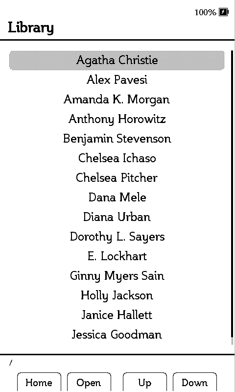
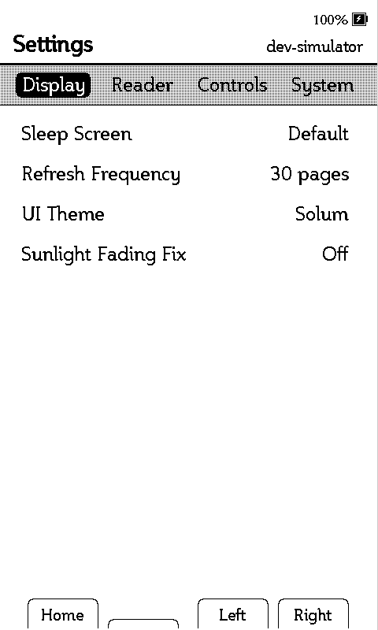
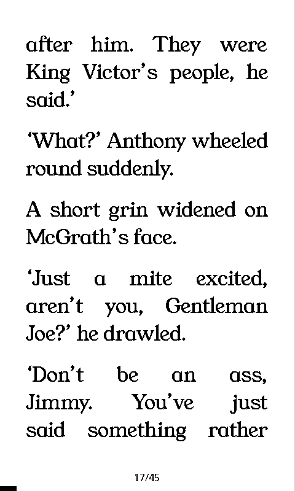
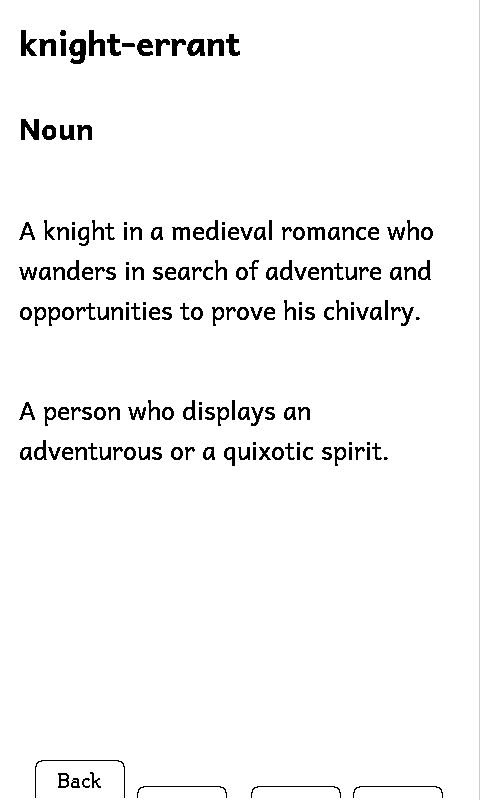
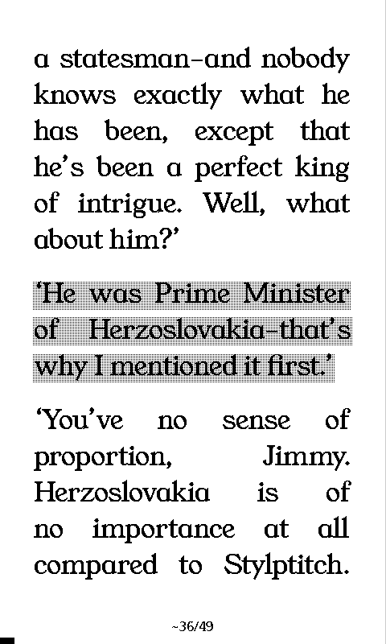

# Minuta

> A personal XTEINK X4 firmware fork made for a soft, simple, and pretty reading experience.

Minuta is a personal fork of [CrossPoint Reader](https://github.com/crosspoint-reader/crosspoint-reader).

One thing I knew very clearly was that I did not want reading statistics in it at all. I wanted the reading experience to stay simple and centred on the book itself. CrossPoint already does this beautifully. It is an excellent firmware with a genuinely great reading experience, and that was exactly the part I wanted to preserve.

Minuta came from wanting a personal fork that leaned further into my own visual preferences. I care a lot about how the home screen looks, how things are spaced, how text sits on a screen, and whether everything feels aligned and intentional. I wanted the firmware itself to have a stronger appearance and personality, and that is what made me start Minuta.

I also spent a month using [Casper](https://github.com/tweakerinc/casper), another excellent custom firmware. I was especially inspired by the minimal home-screen settings in one of its themes.

Minuta is basically my own preferences conjured into actual firmware. I spent an unreasonable amount of time moving things around pixel by pixel because I wanted every screen to feel nice to look at.

Minuta is imagined as a sunlit mythical forest filled with cute little creatures. They are simple, but they care about their appearance. I feel like I resonate with that. I like things to stay minimal in functionality and mechanics, but I still need them to feel good appearance-wise. I hope Minuta can also suit people who share these preferences.

## Gallery

<table>
  <tr>
    <td></td>
    <td></td>
    <td></td>
    <td></td>
    <td></td>
  </tr>
  <tr>
    <td></td>
    <td></td>
    <td></td>
    <td></td>
    <td></td>
  </tr>
</table>

## Support

- Minuta is made for **XTEINK X4 only**.
- It does not support the X3, X4 Pro, Paper Mono, Sticky, or any other e-reader.
- English-only interface and language support.
- EPUB, TXT, and XTC reading.
- Dictionary support.
- SD-card firmware updating, including for USB-locked devices like mine.

## Efficiency

Minuta is intentionally built around XTEINK X4 only. Removing unused device support, inaccessible hardware features, extra language data, and serial logging keeps the firmware smaller and leaves more room for the reader itself.

### Firmware Size Optimization

| Version    | Firmware Size            | Space Saved (vs previous) | Size Reduction (vs Baseline) |
|------------|---------------------------|----------------------------|-------------------------------|
| Baseline   | 4,507,904 bytes / 4.30 MiB | —                           | —                              |
| Minuta 1.0 | 4,031,767 bytes / 3.84 MiB | -476,137 bytes / -465.0 KiB | -10.56%                        |
| Minuta 1.1 | 4,033,219 bytes / 3.85 MiB | +1,452 bytes / +1.4 KiB     | -10.53%                        |
| Minuta 1.2 | 4,005,049 bytes / 3.82 MiB | -28,170 bytes / -27.5 KiB   | -11.15%                        |
| Minuta 1.3 | 3,608,981 bytes / 3.44 MiB | -396,068 bytes / -386.8 KiB | -19.94%                        |

Baseline refers to the firmware size of the CrossPoint build Minuta was forked from.

### Current resource usage (Minuta 1.3)

| Measure                   | Result                          |
|----------------------------|----------------------------------|
| Free app-partition space   | 2,958,171 bytes / 2.82 MiB      |
| RAM used                   | 55,652 bytes / 17.0%            |

These are firmware-size measurements rather than promises about page-turn speed or battery life. Minuta was made smaller so the X4 has less unnecessary firmware to carry around.

## Themes

  

### Solum

Solum is a one-cover theme. It shows the cover of your most recently opened book, with its title and author underneath.

It is meant to feel calm, simple, and focused.

  

### Quartum

Quartum is a 2×2 four-cover theme. It shows the covers of your four most recently opened books and lets you move freely between them with the front buttons. The title and author appear only for the book your cursor is currently on.

Neither theme shows reading progress on the home screen.

## A few intentional choices

Minuta keeps CrossPoint’s reading foundation, but I’ve removed, rearranged, and tweaked quite a few things to make it feel more like the X4 I actually want to use.

* **Less stuff.** I removed Night Mode, Quick Resume, Bookmarks, the Image menu, some Sleep Screen options, a few Power Button actions, Frontlight and touchscreen-related code, and various little Disable, Off, and Ignore choices. I also removed most option boxes in favour of simpler toggleable choices. Some of these might be useful to you, but... well, sorry.

* **A simpler navigation flow.** Settings and the Library/File Browser are tucked into the home-screen menu, accessed through the usual Back button. “Short Back To File Browser” is gone, while **Long-press Back** lets you choose between going to the Library or Settings. I also moved File Transfer into System Settings, and removed the option that moved finished books into another folder, so finished books stay where they originally were.

* **A few things are deliberately fixed.** The battery indicator is always shown, the reader always wakes to the home screen after sleep, the bottom reader margin adapts to the status bar, and book covers use Minuta’s fixed 3:5 ratio. Sleep Screen is reduced to **Default**, **Custom**, and **Cover**, with Cover using **Fit** and **Contrast / Black and White** by default.

* **Reading settings live closer to the reader.** Reader Orientation and Status Bar are now part of the Reader Menu, and “Customise Status Bar” is simply called **Status Bar**. “Manage Fonts” also became **Font Browser**, and I removed **Orient Front Buttons** because I find manually using Remap Front Buttons + Reader Side Buttons more intuitive.

* **My own defaults.** Text Settings, Status Bar, and Controls start with the settings I personally prefer. They’re still customisable, of course. Young Serif is Minuta’s default reader font at **18pt**.

* **A lot of tiny visual things.** I’ve pixel-positioned various elements so they sit better on the actual X4, adjusted the global scrollbar, and reworked a bunch of informational and pop-up screens so they follow the same Minuta layout. OTA updates, SD Card updates, Wi-Fi screens, cache deletion, keyboards, the Font Browser, Hotspot Mode, and several other screens have all received this treatment. I am unfortunately very meticulous about these things!

* **A few changes to the Reader Menu.** I removed **Go Home** because... pressing Back is already right there. I also removed the old reader toolbar entirely because it felt a little too cyber-ish for Minuta. I moved **Reader Orientation** and **Status Bar** into the Reader Menu as well, which just felt like a more sensible place for them.

* **Settings reset when Minuta is installed.** Every firmware flash resets Minuta’s settings to its defaults. This is intentional: since Minuta removes and changes quite a few options, I want each installation to start from a clean set of Minuta settings rather than carrying things over from somewhere else. Your books and other SD card content will not be erased.

* **And then there is Highlight.** I felt like Bookmark was not a particularly accurate way of saving something you wanted to come back to, especially because it stores a page based on its first word and therefore moves around when the font size changes. So Bookmark is gone, and **Highlight** takes its place. You can select the first and last word of a passage, save it, show it with **Highlight Marker**, and browse saved passages through **Highlight List**. I also tried to keep the feature light enough that it doesn’t noticeably slow down page turning.

Overall, Minuta is still CrossPoint underneath, but I’ve tried to make the parts that you actually see and interact with feel much more deliberate, simple, and... Minuta-fied.

## Installation

Download the `.bin` firmware file from the [Releases](../../releases) page. Minuta is for the ordinary XTEINK X4 only. Use the update method available on your device. SD-card updating is included for USB-locked X4 devices. Please back up anything important on your SD card before updating firmware.

## Credits

Minuta is built on [CrossPoint Reader](https://github.com/crosspoint-reader/crosspoint-reader), which provides the core reader and firmware foundation. [Casper](https://github.com/tweakerinc/casper) was also a big inspiration for Minuta’s minimal home-screen direction.

## About updates

Minuta is a passion project, and I’m still actively working on it for now. Once the firmware reaches a stable state that I’m happy with, I intend to consider it finished and stop actively developing it. From then on, I’ll only update it when necessary, rather than continuing to make small improvements.

Thank you for reading, and I hope you enjoy using Minuta! Have a lovely day!!!
